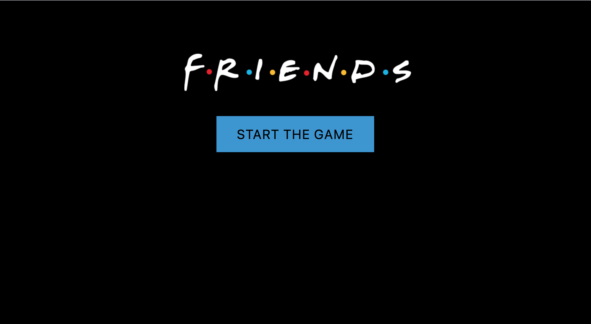
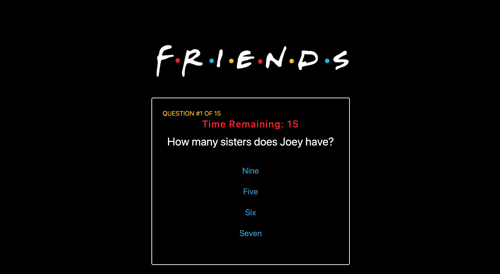
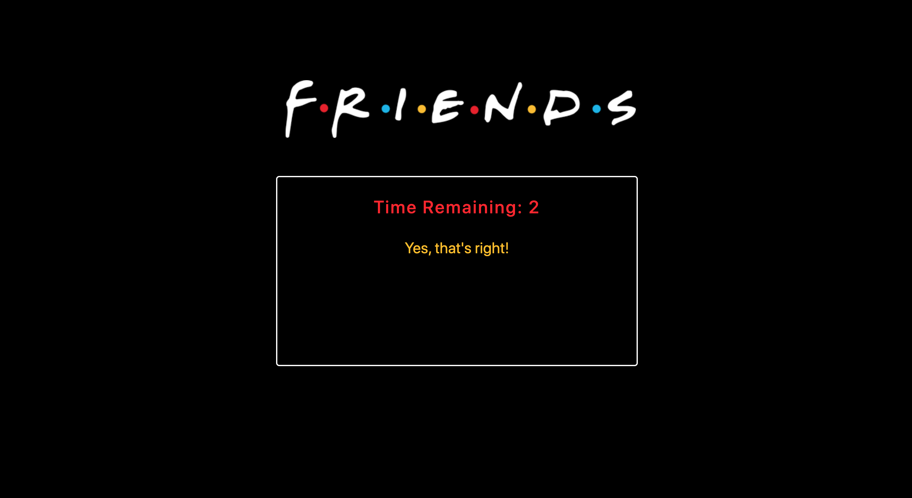
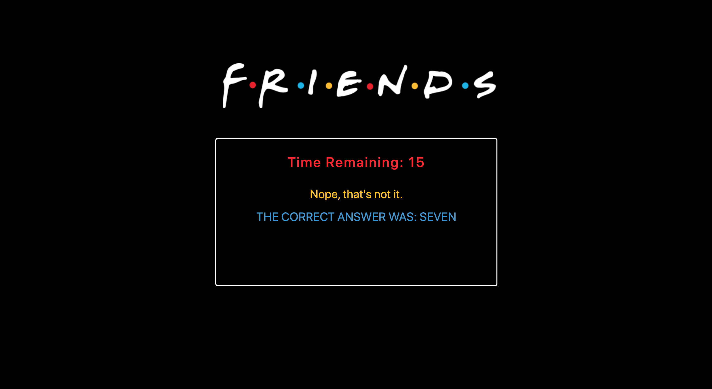
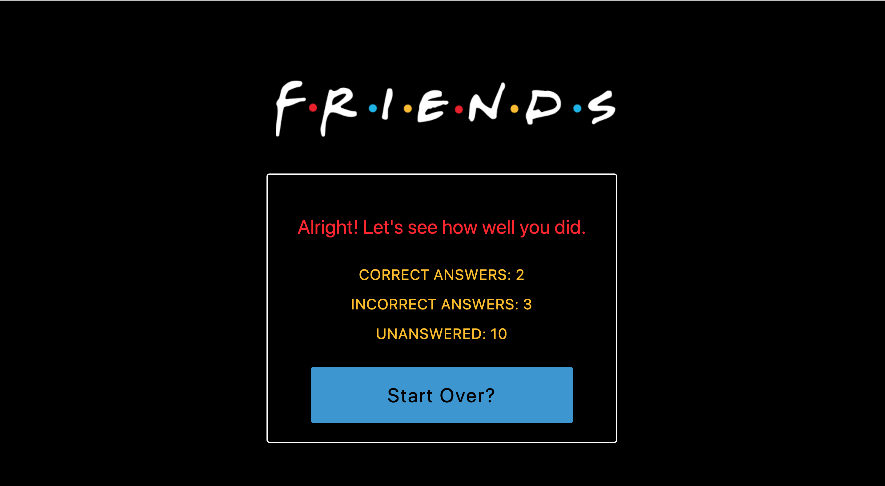

# FRIENDS Trivia Game

## Overview
Test your knowledge of the TV show FRIENDS with this multiple choice trivia game.

### Demo
The FRIENDS Trivia Game is deployed [here](https://nbardoi.github.io/TriviaGame).

### Instructions
When you click Start, you will be given 15 multiple-choice questions about the tv show FRIENDS. You have 15 seconds to answer each question before time runs out. You will be notified if your answer was correct or incorrect; if your answer was incorrect the correct answer will be shown and the next question will automatically show up after a few seconds. When the game ends, your score and the option to start over will be displayed for you.

#### Starting Display

#### Questions

#### Correct Answer

#### Incorrect Answer

#### GameOver

### Built With:
 - HTML
 - CSS
 - JavaScript
 - jQuery
